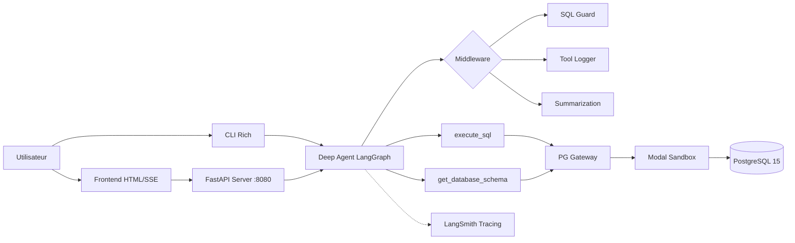

# Neo Deep Agent Lab

Agent SQL conversationnel propulse par LangChain Deep Agents, executant des requetes dans un sandbox PostgreSQL isole via Modal.

Posez des questions en langage naturel sur votre base de donnees — l'agent genere le SQL, l'execute dans un environnement sandboxe, et repond en francais avec des tableaux.

## Architecture



## Fonctionnalites

- **Agent SQL intelligent** — genere et execute du SQL a partir de questions en langage naturel
- **Sandbox isole** — PostgreSQL 15 dans un conteneur Modal, utilisateur read-only
- **Defense in depth** — SQL guard middleware + base read-only + timeout 10s
- **Streaming SSE** — reponses en temps reel via Server-Sent Events
- **Frontend web** — interface chat avec affichage des tool calls (panels collapsibles)
- **CLI interactif** — chat terminal avec Rich (panels, markdown, couleurs)
- **Historique conversationnel** — memoire mono-thread, l'agent se souvient du contexte
- **Summarization** — resume automatique des longues conversations (built-in Deep Agents)
- **Middleware Deep Agents** — `@tool` avec schemas Pydantic stricts, `@wrap_tool_call` pour logging et guard
- **Clean Architecture** — schemas valides, gateway PG type, separation des responsabilites
- **LangSmith tracing** — traces completes des appels agent/tools (optionnel)
- **Multi-provider** — Anthropic (Claude) ou OpenAI (GPT)

## Tech Stack

| Composant | Technologie |
|-----------|------------|
| Agent Framework | LangChain Deep Agents + LangGraph |
| LLM | Claude Sonnet 4 / GPT-5-mini |
| Sandbox | Modal (conteneur isole) |
| Base de donnees | PostgreSQL 15 |
| API Server | FastAPI + SSE |
| Frontend | HTML/JS + Tailwind CSS (CDN) |
| CLI | Rich |
| Validation | Pydantic v2 (strict mode) |
| Tracing | LangSmith |

## Prerequis

- Python 3.11+
- Compte [Modal](https://modal.com) (gratuit pour commencer)
- Cle API Anthropic ou OpenAI
- (Optionnel) Cle API [LangSmith](https://smith.langchain.com)

## Installation

```bash
git clone https://github.com/your-org/neo-deep-agent-lab.git
cd neo-deep-agent-lab

# Environnement virtuel
python -m venv .venv
source .venv/bin/activate

# Dependances
make install

# Configuration
cp .env.example .env
# Remplir les cles API dans .env

# Setup Modal (premiere fois)
make modal-setup
```

## Utilisation

### Frontend Web

```bash
make serve
# Ouvrir http://localhost:8080
```

L'interface affiche :
- Les messages en bulles de conversation
- Les appels d'outils (SQL) dans des panels collapsibles ambre
- Les resultats dans des panels collapsibles verts
- Streaming en temps reel

### CLI Interactif

```bash
make cli
```

Commandes : `reset` (reinitialiser), `clear` (effacer), `quit` (quitter).

### Dump de la base

```bash
# Exporter la base Neo depuis Docker
make dump
```

## Architecture des Modules

```
src/
├── agent/
│   ├── factory.py        # Cablage Deep Agent + tools + middleware
│   └── prompts.py        # System prompt SQL (francais)
├── cli/
│   └── chat.py           # Chat terminal interactif (Rich)
├── config.py             # Settings Pydantic (env vars)
├── constants.py          # Constantes (SQL keywords, SSE types, enums)
├── middleware/
│   ├── logging_mw.py     # @wrap_tool_call — logging async avec timing
│   └── sql_guard.py      # @wrap_tool_call — bloque les requetes destructives
├── sandbox/
│   ├── app.py            # Lifecycle du sandbox Modal (singleton)
│   ├── image.py          # Image Modal (Debian + PG15 + dump)
│   ├── init_pg.sh        # Init PostgreSQL + chargement dump + read-only
│   └── pg.py             # Gateway PostgreSQL (psql) — QueryResult type
├── server/
│   ├── app.py            # FastAPI (SSE streaming, history, frontend)
│   ├── history.py        # Historique conversationnel mono-thread
│   └── static/
│       └── index.html    # Frontend chat (Tailwind, SSE, tool panels)
├── streaming/
│   ├── events.py         # Dataclasses SSE (text-delta, tool-call-*, done)
│   └── sse_encoder.py    # LangGraph v2 stream → SSE (sync + async)
└── tools/
    ├── schemas.py        # Pydantic schemas stricts (ExecuteSQLInput, etc.)
    ├── schema_tool.py    # @tool — introspection schema (tables, colonnes)
    └── sql_tool.py       # @tool — execution SQL via PG gateway
```

## Securite

| Couche | Protection |
|--------|-----------|
| Validation | Schemas Pydantic stricts sur les inputs tools |
| Middleware | SQL guard bloque DROP, DELETE, INSERT, UPDATE, ALTER, etc. |
| PostgreSQL | `default_transaction_read_only = ON` sur l'utilisateur |
| Timeout | Statement timeout 10s cote PostgreSQL |
| Sandbox | Conteneur Modal isole, detruit apres la session |
| Reseau | Aucun acces externe depuis le sandbox |

## Developpement

```bash
# Tests
make test

# Linter
make lint

# Formatage
make format
```

## Licence

MIT
