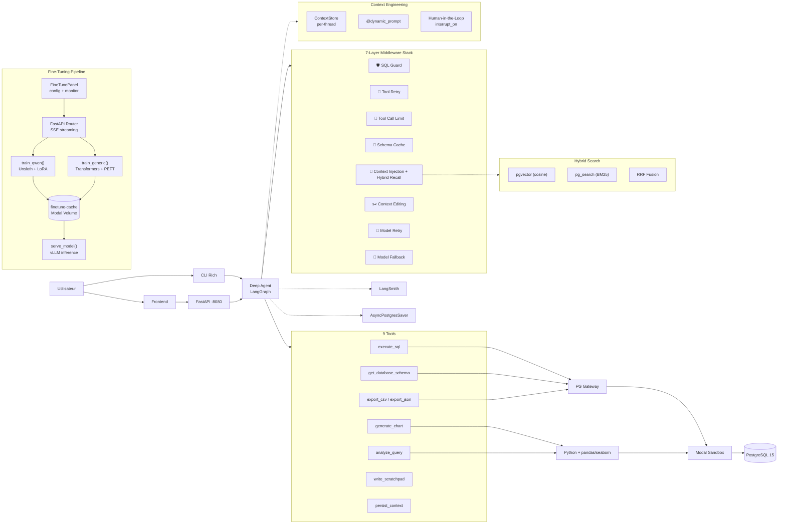

# 🧬 Neo Deep Agent Lab
Conversational SQL Agent with Sandboxed Execution, Context Engineering & Human-in-the-Loop

**Arthur Edmond** · LLM Engineer @ [Swapn](https://swapn.com)
*A production-grade SQL agent powered by LangChain Deep Agents, executing queries in an isolated Modal sandbox with a 7-layer middleware stack, hybrid BM25+vector recall (ParadeDB), a React 19 cyberpunk frontend, and a full fine-tuning pipeline (Unsloth + vLLM on Modal GPUs)*


---

## ⚡ TL;DR

> Posez des questions en langage naturel sur votre base de donnees — l'agent genere le SQL, l'execute dans un **sandbox PostgreSQL isole** (Modal), et repond en francais. **7 middleware** (SQL guard, schema cache, context injection, model fallback...) assurent securite et resilience. **Context engineering complet** : schema cache, scratchpad avec reward +1/-1, **short memory recall** (BM25+vector hybrid search via ParadeDB/RRF), contexte persistant (user + agent), dynamic prompt preview, et **Human-in-the-Loop** (approbation SQL avant execution). **Frontend React 19 cyberpunk** (JetBrains Mono, green neon, 4 themes) avec streaming SSE, tool panels, charts inline, et **switch de provider a chaud** (OpenAI, Anthropic, Ollama local). **Fine-tuning pipeline** : Unsloth (Qwen3.5) + Transformers (LFM2.5) sur GPU Modal (L40S/A100), W&B tracking, inférence vLLM. Persistence PostgreSQL (AsyncPostgresStore + AsyncPostgresSaver).

---

## 🏗️ Architecture




---

## 🔥 Features


### 🤖 Agent SQL Intelligent

Generation et execution de SQL a partir de questions en langage naturel. Support multi-tables, JOINs, CTEs, agregations.

### 🔒 Sandbox Isole

PostgreSQL 15 dans un conteneur Modal ephemere. Utilisateur read-only, timeout 10s, aucun acces reseau externe. Auto-recreation sur timeout/stale reference.

### 🧠 Context Engineering Layer

Implemente 4 stratégies :

| Strategie    | Implementation                                                           |
| ------------ | ------------------------------------------------------------------------ |
| **Write**    | Schema cache middleware + scratchpad tool + persist_context tool          |
| **Select**   | `@dynamic_prompt` injecte schema, user context, scratchpad, summary      |
| **Compress** | `ContextEditingMiddleware` efface les anciens tool results a 80k tokens  |
| **Isolate**  | `interrupt_on` pause l'agent pour approbation humaine avant execute_sql  |

### 📝 Scratchpad avec Reward (+1/-1)

L'agent prend des notes via `write_scratchpad`. L'utilisateur vote +1/-1 sur chaque note depuis le panneau Context Engineering. Les notes avec score negatif sont exclues du prompt. Les stats de reward sont injectees pour que l'agent apprenne quelles observations sont utiles.

### 🔄 Contexte Persistant (User + Agent)

Deux sources de contexte durable :
- **User** : regles metier, hints, contraintes ajoutees manuellement
- **Agent** : faits verifies persistes via `persist_context` (entity mappings, regles deduites)

Chaque entree est taguee `[USER]` ou `[AGENT]` dans le panneau et le prompt.

### 👁️ Dynamic Prompt Preview

Panneau lateral temps reel montrant exactement ce que le LLM recoit : prompt de base, schema cache, user context, scratchpad (classe par score), summary. Chaque section est isolée et token count.

### ✋ Human-in-the-Loop (HITL)

Toggle on/off depuis le header. Quand active, chaque `execute_sql` declenche une modale d'approbation avec 3 options :
- **Approuver** : execute la requete telle quelle
- **Modifier** : editer le SQL avant execution
- **Rejeter** : annuler, l'agent reformule

### 📦 Export CSV / JSON

Tools dedies pour l'export. L'agent genere des fichiers telechargeables avec liens directs dans le chat.

### 📊 Charts Seaborn

Generation de graphiques (bar, line, scatter, hist, heatmap, pie, box) dans le sandbox Modal. Scripts bakes dans l'image Modal a `/opt/scripts/`. Charts affiches inline et telechargeables en PNG.

### 🔬 Analyse SQL Avancee

Statistiques descriptives, correlations, distributions, profiling — le tout execute via pandas dans le sandbox.

### ⚡ Streaming SSE Temps Reel

Tokens streames un par un. Tool panels interactifs avec spinner → check, input SQL visible, boutons Copy/CSV/JSON. Historique complet avec persistence des tool calls au reload.

### 🔍 Short Memory Recall (Hybrid BM25 + Vector)

Automatic semantic recall via `@dynamic_prompt`. Before each LLM call, the agent recalls relevant memories from past conversations using **Reciprocal Rank Fusion** (RRF) combining:

- **pgvector** cosine similarity (weight 0.6)
- **ParadeDB pg_search** BM25 full-text (weight 0.4)

Per-turn caching prevents redundant searches in multi-step runs. Recalled memories are displayed in the sidebar.

### 🛡️ 7 Middleware en Serie

SQL guard, tool retry, tool call limit, schema cache, context injection (with hybrid recall), context editing, model retry, model fallback.

### 💾 Persistence PostgreSQL

`AsyncPostgresSaver` (checkpointer) + `AsyncPostgresStore` (vector store with embeddings). Historique complet avec tool calls persiste au reload de page. ParadeDB image provides both pgvector and pg_search extensions.

### 🔀 Multi-Provider (OpenAI, Anthropic, Ollama)

Switch de provider et modele **a chaud** depuis l'interface. Les modeles Ollama sont detectes dynamiquement via l'API locale (`/api/tags`).

### 🔍 LangSmith Tracing

Traces completes de chaque appel agent, tool, et middleware. Optionnel, activable via `.env`.

### 🎨 Frontend Cyberpunk (React 19 + Tailwind 4)

Interface terminal green neon avec JetBrains Mono, dashed borders, et 4 themes switchables (Green, Pink, Cyan, Light). Layout avec sidebar permanente (240px) + header minimal + panneaux contextuels. Mobile responsive avec sidebar overlay.

### 🧬 Fine-Tuning Pipeline (Modal + Unsloth + vLLM)

Pipeline complet de fine-tuning SQL avec entrainement sur GPU distant et inference via vLLM.


---

## 🧬 Fine-Tuning Pipeline

### Architecture

```
┌──────────────────────────────────────────────────────────────────┐
│                     FineTunePanel (React)                         │
│  ┌────────────┐  ┌─────────────────┐  ┌───────────────────────┐ │
│  │ Config Form│  │Training Monitor │  │  Inference Panel      │ │
│  │ model/gpu  │  │ loss chart      │  │  model select + chat  │ │
│  │ wandb key  │  │ SSE streaming   │  │  vLLM OpenAI compat   │ │
│  └─────┬──────┘  └───────┬─────────┘  └──────────┬────────────┘ │
│        │                 │                        │              │
│  POST /finetune/start    │ SSE events    POST /finetune/infer    │
└────────┼─────────────────┼────────────────────────┼──────────────┘
         ▼                 ▲                        ▼
   ┌─────────────── FastAPI Router ──────────────────────┐
   │  _get_train_function(model)                         │
   │  ├── Qwen/*  → train_qwen (Unsloth image)          │
   │  └── other   → train_generic (Transformers image)   │
   │  poll modal.Dict for progress → SSE to frontend     │
   └─────────────────────┬──────────────────────────────┘
                         ▼
   ┌──────────── Modal Remote GPU ──────────────────────┐
   │                                                     │
   │  Image A: Unsloth (Qwen3.5)     Image B: Generic   │
   │  ┌─────────────────────────┐  ┌──────────────────┐ │
   │  │ unsloth[cu128]==2025.7  │  │ transformers>=5  │ │
   │  │ transformers==4.54.0    │  │ peft + bitsandb  │ │
   │  │ trl==0.19.1             │  │ trl>=0.12        │ │
   │  │                         │  │                  │ │
   │  │ FastLanguageModel       │  │ AutoModelForCLM  │ │
   │  │ + LoRA bf16             │  │ + PEFT LoRA      │ │
   │  └─────────────────────────┘  └──────────────────┘ │
   │                                                     │
   │  Image C: vLLM                                      │
   │  ┌─────────────────────────────────────────────┐   │
   │  │ vllm==0.12.0                                │   │
   │  │ serve_model() → OpenAI-compat /v1/chat/...  │   │
   │  │ L40S GPU, scaledown 15min                   │   │
   │  └─────────────────────────────────────────────┘   │
   │                                                     │
   │  ┌─────────────────────────────────┐               │
   │  │    finetune-cache (Volume)      │               │
   │  │    /cache/models/               │               │
   │  │    /cache/output/               │               │
   │  └─────────────────────────────────┘               │
   └─────────────────────────────────────────────────────┘
```

### Modeles Supportes

| Modele                   | Params | VRAM (LoRA bf16) | Engine             | GPU Recommande |
| ------------------------ | ------ | ---------------- | ------------------ | -------------- |
| `Qwen/Qwen3.5-0.8B`    | 0.8B   | 3 GB             | Unsloth            | T4             |
| `Qwen/Qwen3.5-2B`      | 2B     | 5 GB             | Unsloth            | T4 / L40S      |
| `Qwen/Qwen3.5-4B`      | 4B     | 10 GB            | Unsloth            | L40S           |
| `Qwen/Qwen3.5-9B`      | 9B     | 22 GB            | Unsloth            | L40S / A100    |
| `LiquidAI/LFM2.5-350M` | 350M   | <1 GB            | Transformers + PEFT | T4             |

### Dataset

**`gretelai/synthetic_text_to_sql`** — 105,851 enregistrements (100K train / 5,851 test), 12 colonnes, 100 domaines, 23M tokens. Formate en SFT chat :

```
System: You are a SQL expert. Given a database schema and a natural language question, generate the correct SQL query.
User: Schema: {sql_context}\n\nQuestion: {sql_prompt}
Assistant: {sql}
```

### Hyperparametres par Defaut

| Parametre | Valeur | Description |
|-----------|--------|-------------|
| `num_epochs` | 3 | Nombre d'epoques d'entrainement |
| `learning_rate` | 2×10⁻⁴ | Taux d'apprentissage (cosine scheduler) |
| `batch_size` | 4 | Taille de batch par GPU |
| `max_seq_length` | 2048 | Longueur maximale de sequence |
| `lora_r` | 16 | Rang LoRA (dimension du low-rank) |
| `lora_alpha` | 32 | Alpha LoRA (scaling factor = α/r) |
| `dataset_max_samples` | 10,000 | Sous-echantillon du dataset |
| `warmup_ratio` | 0.05 | Fraction du warmup lineaire |
| `lr_scheduler` | cosine | Decroissance cosinus du learning rate |

### W&B Integration

Tracking optionnel via Weights & Biases. Configurable depuis le frontend (champ API key dans le panneau) ou via `.env` :

```env
WANDB_API_KEY=wandb_v1_...
```

Quand active, chaque job de fine-tuning cree un run W&B avec les metriques : loss, learning_rate, epoch, validation_loss.

### Inference vLLM

Apres l'entrainement, le modele est sauvegarde dans le volume Modal `finetune-cache`. Le serveur vLLM :

1. Charge le dernier checkpoint depuis `/cache/models/`
2. Expose un endpoint **OpenAI-compatible** (`/v1/chat/completions`)
3. Tourne sur L40S avec auto-scaledown apres 15 min d'inactivite
4. Supporte 32 requetes concurrentes

```bash
# Deployer l'app Modal (images + fonctions)
modal deploy src/finetune/modal_app.py

# Query le modele deploye
curl -X POST <vllm_url>/v1/chat/completions \
  -H 'Content-Type: application/json' \
  -d '{
    "messages": [
      {"role": "system", "content": "You are a SQL expert..."},
      {"role": "user", "content": "Schema: CREATE TABLE users (id INT, name TEXT);\n\nQuestion: How many users?"}
    ],
    "temperature": 0.1
  }'
```

### Training Results

| Model | Dataset | Epochs | Final Loss | Steps | Duration | GPU | TPS |
|-------|---------|--------|-----------|-------|----------|-----|-----|
| LFM2.5-350M | synthetic_text_to_sql (10K) | 3 | 0.538 | 7,500 | 4m 04s | L40S | 30.6 |
| LFM2.5-350M | synthetic_text_to_sql (10K) | 1 | 0.602 | 2,500 | 1m 52s | L40S | 31.0 |

### Endpoints Fine-Tuning

| Method | Endpoint | Description |
|--------|----------|-------------|
| `POST` | `/finetune/start` | Lancer un job (SSE streaming des progress events) |
| `POST` | `/finetune/cancel/{job_id}` | Annuler un job en cours |
| `GET` | `/finetune/jobs` | Lister les jobs de la session |
| `GET` | `/finetune/models` | Lister les modeles entraines dans le volume |
| `POST` | `/finetune/serve` | Deployer le serveur vLLM |
| `POST` | `/finetune/infer` | Proxy de requete chat vers vLLM |


---

## 🛡️ Middleware Stack

> L'ordre d'execution est important — les middleware tools s'executent avant les middleware modele.

```
                    ┌─────────────────────────────────────────────────────────────────┐
                    │                  MIDDLEWARE EXECUTION ORDER                     │
                    │                                                                 │
  Tool-level:       │  ┌──────────┐  ┌───────────┐  ┌───────────┐                   │
                    │  │ SQL Guard │→ │ Tool Retry│→ │ Call Limit│                   │
                    │  │ block DDL │  │ 2x backoff│  │ 20/run    │                   │
                    │  └──────────┘  └───────────┘  └───────────┘                   │
                    │                                    ↓                            │
                    │  ┌──────────────┐                                               │
                    │  │ Schema Cache │  intercepts get_database_schema results       │
                    │  │ @wrap_tool   │  caches in ContextStore per thread            │
                    │  └──────────────┘                                               │
                    │                                                                 │
  Context-level:    │  ┌───────────────────────────────────────────────────────┐      │
                    │  │ Context Injection (@dynamic_prompt)                   │      │
                    │  │ + hybrid recall (BM25+vector via RRF)               │      │
                    │  │ injects: schema + ctx + scratchpad + summary + recall│      │
                    │  └───────────────────────────────────────────────────────┘      │
                    │  ┌───────────────────────────────────────────────────────┐      │
                    │  │ Context Editing — clear tool results > 80k tokens    │      │
                    │  │ keep=3 most recent, placeholder: [cleared]           │      │
                    │  └───────────────────────────────────────────────────────┘      │
                    │                                                                 │
  Model-level:      │  ┌─────────────┐    ┌────────────────┐                         │
                    │  │ Model Retry │ →  │ Model Fallback │                         │
                    │  │ 3x backoff  │    │ GPT → Claude   │                         │
                    │  └─────────────┘    └────────────────┘                         │
                    │                                                                 │
  HITL:             │  interrupt_on: execute_sql → approval modal (approve/edit/reject)│
                    └─────────────────────────────────────────────────────────────────┘
```

| #   | Middleware                  | Type     | Role                                                                  | Configuration                    |
| --- | -------------------------- | -------- | --------------------------------------------------------------------- | -------------------------------- |
| 1   | `sql_guard_middleware`      | Custom   | Bloque les requetes destructives (DROP, DELETE, INSERT, ALTER...)     | Whitelist: SELECT, WITH, EXPLAIN |
| 2   | `ToolRetryMiddleware`      | Built-in | Retry automatique des tools en echec (timeout sandbox, erreur reseau) | 2 retries, backoff 2x            |
| 3   | `ToolCallLimitMiddleware`  | Built-in | Limite les appels tools par run — empeche les boucles infinies        | 20 calls/run, soft exit          |
| 4   | `schema_cache_middleware`  | Custom   | Cache les resultats `get_database_schema` dans ContextStore           | `@wrap_tool_call`                |
| 5   | `inject_context`           | Custom   | Enrichit le system prompt + hybrid recall (BM25+vector RRF)           | `@dynamic_prompt`, per-turn cache|
| 6   | `ContextEditingMiddleware` | Built-in | Efface les anciens resultats tools quand le contexte depasse le seuil | 80k tokens, garde 3 derniers     |
| 7   | `ModelRetryMiddleware`     | Built-in | Retry automatique des appels LLM (rate limit, API timeout, 5xx)       | 3 retries, backoff 2x            |
| —   | `ModelFallbackMiddleware`  | Built-in | Bascule sur un modele de secours si le principal echoue               | Optionnel (config .env)          |


---

## 🛠️ Tech Stack


| Composant       | Technologie                                                     |
| --------------- | --------------------------------------------------------------- |
| Agent Framework | LangChain Deep Agents + LangGraph v2                            |
| LLM             | OpenAI / Anthropic / **Ollama** (switch a chaud via UI)         |
| Middleware      | `langchain.agents.middleware` (4 built-in + 3 custom)           |
| Context Store   | Per-thread dataclass (schema, ctx, scratchpad, summary, recall) |
| Sandbox         | Modal (conteneur isole, PG15, read-only)                        |
| Base de donnees | ParadeDB (PostgreSQL 17 + pgvector + pg_search/BM25)            |
| Persistence     | AsyncPostgresStore (vectors) + AsyncPostgresSaver (checkpoints) |
| Search          | Hybrid BM25+vector via Reciprocal Rank Fusion (RRF)             |
| Fine-Tuning     | Unsloth (Qwen3.5) + Transformers/PEFT (LFM2.5) sur Modal GPUs  |
| Inference       | vLLM 0.12 (OpenAI-compatible endpoint sur Modal L40S)           |
| Tracking        | W&B (Weights & Biases) pour metriques d'entrainement            |
| API Server      | FastAPI + SSE streaming                                         |
| Frontend        | React 19 + Vite 6 + Tailwind CSS 4 (cyberpunk terminal theme)  |
| CLI             | Rich (panels, markdown, spinners)                               |
| Validation      | Pydantic v2 (strict mode)                                       |
| Tracing         | LangSmith                                                       |
| Code Quality    | Ruff + Pyright                                                  |


---

## 📋 Prerequis

- Python 3.11+
- Node.js 18+ (pour le frontend Next.js)
- Docker (pour ParadeDB — PostgreSQL 17 + pgvector + pg_search)
- Compte [Modal](https://modal.com) (gratuit pour commencer)
- Cle API Anthropic ou OpenAI
- (Optionnel) [Ollama](https://ollama.ai) installe localement pour les modeles open-source
- (Optionnel) Cle API [LangSmith](https://smith.langchain.com)

---

## 🚀 Quick Start

```bash
# Clone
git clone https://github.com/your-org/neo-deep-agent-lab.git
cd neo-deep-agent-lab

# Setup
python -m venv .venv && source .venv/bin/activate
make install

# Config
cp .env.example .env
# Remplir les cles API
```

### Configuration (.env)

```env
# ── LLM principal ──
LLM_PROVIDER=openai
LLM_MODEL=gpt-5-mini-2025-08-07
OPENAI_API_KEY=sk-...

# ── LLM fallback (optionnel) ──
LLM_FALLBACK_PROVIDER=anthropic
LLM_FALLBACK_MODEL=claude-sonnet-4-20250514
ANTHROPIC_API_KEY=sk-ant-...

# ── Ollama (optionnel, modeles locaux) ──
OLLAMA_BASE_URL=http://localhost:11434

# ── Middleware ──
CONTEXT_EDITING_TRIGGER=80000    # tokens seuil pour nettoyer le contexte
TOOL_CALL_LIMIT_PER_RUN=20      # max tool calls par run
HITL_ENABLED=true                # human-in-the-loop (toggle via UI)

# ── Modal ──
MODAL_TOKEN_ID=...
MODAL_TOKEN_SECRET=...

# ── W&B (optionnel, pour fine-tuning tracking) ──
WANDB_API_KEY=wandb_v1_...

# ── LangSmith (optionnel) ──
LANGCHAIN_TRACING_V2=true
LANGCHAIN_API_KEY=lsv2_...
LANGCHAIN_PROJECT=neo-deep-agent-lab
```

---

## 💻 Utilisation

### Frontend Web (Next.js)

```bash
# Terminal 1 — Backend
make serve
# → FastAPI on http://localhost:8000

# Terminal 2 — Frontend
make front
# → Next.js on http://localhost:3000 (proxies /api/* to FastAPI)
```

| Feature           | Description                                                   |
| ----------------- | ------------------------------------------------------------- |
| Streaming SSE     | Tokens streames via fetch + ReadableStream                    |
| Tool panels       | Accordeons collapsibles avec status running/done              |
| Charts inline     | Graphiques Seaborn affiches directement dans le chat          |
| Provider switch   | Dropdown provider + modele, switch a chaud sans reload        |
| HITL modal        | Approve / Edit / Reject avant execution SQL                   |
| Context sidebar   | Schema cache, user context CRUD, scratchpad avec rewards      |
| Recalled memories | Section recall avec scores (hybrid BM25+vector)               |
| Markdown          | react-markdown avec tables, code blocks                       |
| Design            | Tailwind CSS 4, dark theme zinc-950, responsive layout        |


### CLI Interactif

```bash
make cli
```


| Commande | Action                        |
| -------- | ----------------------------- |
| `reset`  | Reinitialiser la conversation |
| `clear`  | Effacer l'ecran               |
| `quit`   | Quitter                       |


### Dump de la base

```bash
make dump   # Export PG depuis Docker → data/neo_dump.sql
```

---

## 📐 Architecture des Modules

```
src/
│
├── 🤖 agent/
│   ├── factory.py             # Factory Deep Agent + 7-middleware stack + interrupt_on
│   └── prompts.py             # System prompt SQL (francais, scratchpad guidelines, reward)
│
├── 💻 cli/
│   └── chat.py                # Chat terminal Rich (sync streaming)
│
├── ⚙️ config.py                # Settings Pydantic (env vars, HITL, recall, hybrid search)
├── 📋 constants.py             # Enums (LLMProvider, SSEEventType, SQL keywords)
│
├── 🧠 context/
│   ├── store.py               # ContextStore per-thread (schema, ctx, scratchpad, recall)
│   ├── hybrid_search.py       # BM25+vector hybrid search with RRF fusion (ParadeDB)
│   ├── pg_sync.py             # Sync wrappers for AsyncPostgresStore operations
│   └── thread_var.py          # ContextVar for passing thread_id to tools
│
├── 🛡️ middleware/
│   ├── sql_guard.py           # AgentMiddleware — bloque requetes destructives
│   ├── schema_cache.py        # @wrap_tool_call — cache get_database_schema results
│   └── context_injection.py   # @dynamic_prompt — injecte schema+ctx+scratchpad+recall
│
├── 💾 persistence/
│   └── pg.py                  # AsyncPostgresStore + AsyncPostgresSaver + BM25 index
│
├── 🔒 sandbox/
│   ├── app.py                 # Lifecycle sandbox Modal (singleton, auto-recreate on stale)
│   ├── image.py               # Image Modal (Debian + PG15 + scripts baked in)
│   ├── init_pg.sh             # Init PostgreSQL + read-only user
│   ├── pg.py                  # Gateway PG — QueryResult(stdout, stderr, exit_code)
│   └── scripts/
│       ├── chart.py           # Standalone Seaborn chart renderer (runs in sandbox)
│       └── analysis.py        # Standalone pandas analysis (runs in sandbox)
│
├── 🧬 finetune/
│   ├── config.py              # Pydantic models (ModelChoice, GPUChoice, FineTuneConfig, FineTuneJob)
│   ├── modal_app.py           # Modal functions (train_qwen, train_generic, serve_model, list_models)
│   └── router.py              # FastAPI router (/finetune/start SSE, /serve, /infer, /models, /jobs)
│
├── 🌐 server/
│   ├── app.py                 # FastAPI (SSE, /context, /hitl, /resume, /search, /finetune)
│   ├── auth.py                # Clerk JWT verification (optional)
│   └── static/                # Legacy vanilla JS frontend
│
├── 📡 streaming/
│   ├── events.py              # SSE event dataclasses (text-delta, tool-call-*, interrupt-request)
│   └── sse_encoder.py         # LangGraph v2 → SSE (tool results exclus du texte)
│
└── 🔧 tools/
    ├── _helpers.py            # Shared: run_sandbox_script, store_file, fetch_csv
    ├── schemas.py             # Pydantic v2 strict schemas (all tool inputs)
    ├── schema_tool.py         # @tool — introspection schema (tables, colonnes)
    ├── sql_tool.py            # @tool — execution SQL via PG gateway → markdown
    ├── export_tool.py         # @tool — export CSV/JSON avec download link
    ├── chart_tool.py          # @tool — charts Seaborn dans le sandbox (PNG)
    ├── analysis_tool.py       # @tool — stats pandas (describe, corr, distributions)
    ├── scratchpad_tool.py     # @tool — agent session notes with reward awareness
    └── context_tool.py        # @tool — agent persists verified facts to durable context

frontend/                       # React 19 + Vite 6 + Tailwind CSS 4 (cyberpunk terminal theme)
├── vite.config.ts              # Dev server proxy → FastAPI :8080
├── src/
│   ├── App.tsx                 # Root layout (sidebar + header + routes)
│   ├── main.tsx                # Entry point (JetBrains Mono, Clerk, BrowserRouter)
│   ├── index.css               # Cyberpunk theme (4 themes, CSS variables, dashed borders)
│   ├── components/
│   │   ├── layout/
│   │   │   ├── Sidebar.tsx     # Permanent sidebar (nav + threads, 240px)
│   │   │   ├── Header.tsx      # Minimal header (title + controls + theme picker)
│   │   │   ├── LogPanel.tsx    # Live log streaming panel
│   │   │   └── MiddlewarePanel.tsx  # Middleware toggle overlay
│   │   ├── chat/
│   │   │   ├── ChatPanel.tsx   # Chat zone (messages + input)
│   │   │   ├── MessageBubble.tsx  # User/assistant message with ReactMarkdown
│   │   │   └── ToolStep.tsx    # Collapsible tool call accordion
│   │   ├── context/
│   │   │   └── ContextSidebar.tsx  # Context engineering sidebar (full CRUD)
│   │   ├── finetune/
│   │   │   └── FineTunePanel.tsx   # Config + training monitor + loss chart + inference
│   │   ├── hitl/
│   │   │   └── HitlModal.tsx   # HITL approval modal (approve/edit/reject)
│   │   ├── agents/
│   │   │   └── AgentTabs.tsx   # Multi-agent tab bar
│   │   └── providers/
│   │       └── ProviderSelect.tsx  # Provider + model dropdowns
│   ├── stores/                 # Zustand stores (8 stores)
│   │   ├── chat.ts             # Messages, streaming, SSE consumption
│   │   ├── finetune.ts         # Fine-tune jobs, config, loss history, inference
│   │   ├── context.ts          # Context CRUD, prompt preview
│   │   ├── documents.ts        # RAG document indexing with SSE
│   │   ├── session.ts          # Session token management
│   │   ├── agents.ts           # Multi-agent thread management
│   │   ├── providers.ts        # LLM provider switching
│   │   └── hitl.ts             # HITL status + toggle
│   ├── lib/
│   │   ├── api.ts              # Fetch wrapper with auth headers
│   │   └── sse.ts              # SSE streaming utility
│   └── types/
│       └── index.ts            # TypeScript interfaces (including FineTune*)
```

---

## 🔒 Securite — Defense in Depth


| Couche          | Protection                                                   | Implementation                                 |
| --------------- | ------------------------------------------------------------ | ---------------------------------------------- |
| **Validation**  | Schemas Pydantic stricts sur les inputs tools                | `model_config = {"strict": True}`              |
| **SQL Guard**   | Bloque DROP, DELETE, INSERT, UPDATE, ALTER, TRUNCATE, CREATE | `AgentMiddleware` custom                       |
| **HITL**        | Approbation humaine avant chaque execute_sql (optionnel)     | `interrupt_on` + approval modal                |
| **PostgreSQL**  | `default_transaction_read_only = ON`                         | `init_pg.sh`                                   |
| **Timeout**     | Statement timeout 10s cote PostgreSQL                        | `psql -v statement_timeout=10000`              |
| **Tool Limit**  | 20 tool calls max par run                                    | `ToolCallLimitMiddleware` built-in             |
| **Context**     | Nettoyage auto des anciens resultats (80k tokens)            | `ContextEditingMiddleware` built-in            |
| **Retry**       | Backoff exponentiel (pas de spam API/sandbox)                | `ToolRetryMiddleware` + `ModelRetryMiddleware` |
| **Sandbox**     | Conteneur Modal isole, detruit apres session                 | Modal ephemeral sandbox                        |
| **Reseau**      | Aucun acces externe depuis le sandbox                        | Modal network isolation                        |
| **Fallback**    | Bascule auto sur modele secondaire si le principal fail      | `ModelFallbackMiddleware` built-in             |
| **Reward**      | Notes scratchpad negatives exclues du prompt (score < 0)     | Context injection middleware                   |


---

## 🧠 Context Engineering

Le context engineering layer implemente 4 stratégies :

### Write — Persister l'information

- **Schema cache** : le middleware `@wrap_tool_call` intercepte les resultats de `get_database_schema` et les sauvegarde dans `ContextStore`. Plus besoin de re-fetch le schema a chaque question.
- **Scratchpad** : l'agent note ses observations via `write_scratchpad`. Les notes sont scorees par l'utilisateur (+1/-1).
- **Persist context** : l'agent peut sauvegarder des faits verifies via `persist_context` dans le contexte durable (entity mappings, regles metier deduites).

### Select — Injecter le bon contexte

Le middleware `@dynamic_prompt` enrichit le system prompt avant chaque appel LLM avec :
- Schema cache (tables decouverts)
- User context (hints user + faits agent, tagges par source)
- Scratchpad (notes classees par reward score, negatives exclues)
- Conversation summary (si la conversation est longue)

### Compress — Gerer la taille du contexte

- `ContextEditingMiddleware` efface les anciens resultats tools quand le contexte depasse 80k tokens (garde les 3 derniers).
- Les notes scratchpad avec score negatif sont exclues du prompt pour economiser de l'espace.

### Isolate — Controle humain

- `interrupt_on` pause l'agent avant chaque `execute_sql`
- Modal d'approbation : Approuver / Modifier le SQL / Rejeter
- Toggle on/off depuis le header sans restart serveur

---

## 🧪 Developpement

```bash
make test      # Tests (tools, middleware, schemas)
make lint      # Ruff linter
make format    # Ruff formatter
```

---

## 📡 API Endpoints

| Method   | Endpoint                     | Description                                        |
| -------- | ---------------------------- | -------------------------------------------------- |
| `GET`    | `/`                          | Frontend HTML                                      |
| `GET`    | `/health`                    | Health check + agent status                        |
| `GET`    | `/history`                   | Historique complet (messages + tool calls/results)  |
| `POST`   | `/chat`                      | Chat SSE streaming                                 |
| `POST`   | `/resume`                    | Resume agent apres HITL interrupt                   |
| `POST`   | `/reset`                     | Reset conversation (nouveau thread)                |
| `GET`    | `/providers`                 | Liste providers + modeles disponibles               |
| `POST`   | `/provider`                  | Switch provider/modele a chaud                      |
| `GET`    | `/context`                   | Etat du context store (schema, ctx, scratchpad)     |
| `POST`   | `/context`                   | Ajouter un contexte utilisateur                     |
| `DELETE` | `/context`                   | Clear all context                                   |
| `DELETE` | `/context/{index}`           | Supprimer une entree contexte                       |
| `POST`   | `/scratchpad/{index}/reward` | Vote +1/-1 sur une note scratchpad                  |
| `GET`    | `/hitl`                      | Statut HITL (enabled/disabled)                      |
| `POST`   | `/hitl`                      | Toggle HITL on/off (recreate agent)                 |
| `GET`    | `/prompt-preview`            | Dynamic prompt complet tel qu'envoye au LLM         |
| `GET`    | `/download/{id}/{filename}`  | Telecharger un fichier exporte                      |
| `POST`   | `/finetune/start`            | Lancer un fine-tuning job (SSE streaming)            |
| `POST`   | `/finetune/cancel/{job_id}`  | Annuler un job en cours                              |
| `GET`    | `/finetune/jobs`             | Lister les jobs de la session                        |
| `GET`    | `/finetune/models`           | Lister les modeles entraines (Modal volume)          |
| `POST`   | `/finetune/serve`            | Deployer serveur vLLM pour inference                 |
| `POST`   | `/finetune/infer`            | Proxy chat completion vers vLLM                      |

---

**Arthur Edmond** · [Swapn](https://swapn.com)
Built with LangChain Deep Agents, Modal, Unsloth, and an obsession for clean middleware stacks
