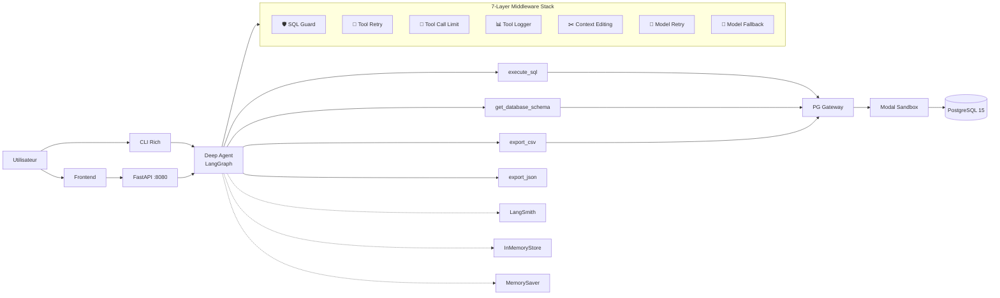

# 🧬 Neo Deep Agent Lab
Conversational SQL Agent with Sandboxed Execution & Deep Agents Middleware

**Arthur Edmond** · LLM Engineer @ [Swapn](https://swapn.com)
*A production-grade SQL agent powered by LangChain Deep Agents, executing queries in an isolated Modal sandbox with 7-layer middleware defense*


---

## ⚡ TL;DR

> Posez des questions en langage naturel sur votre base de donnees — l'agent genere le SQL, l'execute dans un **sandbox PostgreSQL isole** (Modal), et repond en francais. **7 middleware** (SQL guard, tool retry, context editing, model fallback...) assurent securite et resilience. Frontend avec streaming SSE, tool panels interactifs, et export CSV/JSON.

---

## 🏗️ Architecture




---

## 🔥 Features


### 🤖 Agent SQL Intelligent

Generation et execution de SQL a partir de questions en langage naturel. Support multi-tables, JOINs, CTEs, agregations.

### 🔒 Sandbox Isole

PostgreSQL 15 dans un conteneur Modal ephemere. Utilisateur read-only, timeout 10s, aucun acces reseau externe.

### 📦 Export CSV / JSON

Tools dedies pour l'export. L'agent genere des fichiers telechargeable avec liens directs dans le chat.


### ⚡ Streaming SSE Temps Reel

Tokens streames un par un. Tool panels interactifs avec spinner → check, input SQL visible, boutons Copy/CSV/JSON.

### 🛡️ 7 Middleware en Serie

SQL guard, tool retry, tool call limit, logging, context editing, model retry, model fallback — chaque requete traverse 7 couches.

### 💾 Memoire & Historique

`MemorySaver` (checkpointer) + `InMemoryStore` (StoreBackend). Summarization automatique built-in Deep Agents.

### 🔍 LangSmith Tracing

Traces completes de chaque appel agent, tool, et middleware. Optionnel, activable via `.env`.


---

## 🛡️ Middleware Stack

> L'ordre d'execution est important — les middleware tools s'executent avant les middleware modele.

```
                    ┌─────────────────────────────────────────────────────────┐
                    │              MIDDLEWARE EXECUTION ORDER                 │
                    │                                                         │
  Tool calls:       │  ┌──────────┐  ┌───────────┐  ┌───────────┐  ┌──────┐ │
                    │  │ SQL Guard │→ │ Tool Retry│→ │ Call Limit│→ │ Log  │ │
                    │  │ block DDL │  │ 2x backoff│  │ 20/run    │  │timing│ │
                    │  └──────────┘  └───────────┘  └───────────┘  └──────┘ │
                    │                                                         │
  Context:          │  ┌──────────────────────────────────────────────┐       │
                    │  │ Context Editing — clear tool results > 80k  │       │
                    │  │ keep=3 most recent, placeholder: [cleared]  │       │
                    │  └──────────────────────────────────────────────┘       │
                    │                                                         │
  Model calls:      │  ┌─────────────┐    ┌────────────────┐                 │
                    │  │ Model Retry │ →  │ Model Fallback │                 │
                    │  │ 3x backoff  │    │ GPT → Claude   │                 │
                    │  └─────────────┘    └────────────────┘                 │
                    └─────────────────────────────────────────────────────────┘
```


| #   | Middleware                 | Source   | Role                                                                  | Configuration                    |
| --- | -------------------------- | -------- | --------------------------------------------------------------------- | -------------------------------- |
| 1   | `SQLGuardMiddleware`       | Custom   | Bloque les requetes destructives (DROP, DELETE, INSERT, ALTER...)     | Whitelist: SELECT, WITH, EXPLAIN |
| 2   | `ToolRetryMiddleware`      | Built-in | Retry automatique des tools en echec (timeout sandbox, erreur reseau) | 2 retries, backoff 2x, jitter    |
| 3   | `ToolCallLimitMiddleware`  | Built-in | Limite les appels tools par run — empeche les boucles infinies        | 20 calls/run, soft exit          |
| 4   | `LogToolCallsMiddleware`   | Custom   | Log chaque tool call avec timing (ms), taille input/output            | Sync + async                     |
| 5   | `ContextEditingMiddleware` | Built-in | Efface les anciens resultats tools quand le contexte depasse le seuil | 80k tokens, garde 3 derniers     |
| 6   | `ModelRetryMiddleware`     | Built-in | Retry automatique des appels LLM (rate limit, API timeout, 5xx)       | 3 retries, backoff 2x, jitter    |
| 7   | `ModelFallbackMiddleware`  | Built-in | Bascule sur un modele de secours si le principal echoue               | Optionnel (config .env)          |


---

## 🛠️ Tech Stack


| Composant       | Technologie                                            |
| --------------- | ------------------------------------------------------ |
| Agent Framework | LangChain Deep Agents + LangGraph v2                   |
| LLM             | Claude Sonnet 4 / GPT-5-mini (+ fallback configurable) |
| Middleware      | `langchain.agents.middleware` (5 built-in + 2 custom)  |
| Sandbox         | Modal (conteneur isole, PG15, read-only)               |
| Base de donnees | PostgreSQL 15                                          |
| API Server      | FastAPI + SSE streaming                                |
| Frontend        | HTML/JS vanilla            |
| CLI             | Rich (panels, markdown, spinners)                      |
| Validation      | Pydantic v2 (strict mode)                              |
| Tracing         | LangSmith                                              |
| Store           | InMemoryStore + StoreBackend (Deep Agents)             |


---

## 📋 Prerequis

- Python 3.11+
- Compte [Modal](https://modal.com) (gratuit pour commencer)
- Cle API Anthropic ou OpenAI
- (Optionnel) Cle API [LangSmith](https://smith.langchain.com)

---

## 🚀 Quick Start

```bash
# Clone
git clone https://github.com/your-org/neo-deep-agent-lab.git
cd neo-deep-agent-lab

# Setup
python -m venv .venv && source .venv/bin/activate
make install

# Config
cp .env.example .env
# Remplir les cles API
```

### Configuration (.env)

```env
# ── LLM principal ──
LLM_PROVIDER=openai
LLM_MODEL=gpt-5-mini-2025-08-07
OPENAI_API_KEY=sk-...

# ── LLM fallback (optionnel) ──
LLM_FALLBACK_PROVIDER=anthropic
LLM_FALLBACK_MODEL=claude-sonnet-4-20250514
ANTHROPIC_API_KEY=sk-ant-...

# ── Middleware ──
CONTEXT_EDITING_TRIGGER=80000    # tokens seuil pour nettoyer le contexte
TOOL_CALL_LIMIT_PER_RUN=20      # max tool calls par run

# ── Modal ──
MODAL_TOKEN_ID=...
MODAL_TOKEN_SECRET=...

# ── LangSmith (optionnel) ──
LANGCHAIN_TRACING_V2=true
LANGCHAIN_API_KEY=lsv2_...
LANGCHAIN_PROJECT=neo-deep-agent-lab
```

---

## 💻 Utilisation

### Frontend Web

```bash
make serve
# → http://localhost:8080
```


| Feature     | Description                                                     |
| ----------- | --------------------------------------------------------------- |
| Streaming   | Tokens affiches un par un en temps reel                         |
| Tool panels | Collapsibles avec spinner → check, input SQL, output table      |
| Actions     | Boutons **Copy** / **CSV** / **JSON** sur chaque resultat       |
| Download    | Liens de telechargement pour les exports agent                  |
| Design      | (Fira Code, DM Mono, dark #111, borders 0.25px) |


### CLI Interactif

```bash
make cli
```


| Commande | Action                        |
| -------- | ----------------------------- |
| `reset`  | Reinitialiser la conversation |
| `clear`  | Effacer l'ecran               |
| `quit`   | Quitter                       |


### Dump de la base

```bash
make dump   # Export PG depuis Docker → data/neo_dump.sql
```

---

## 📐 Architecture des Modules

```
src/
│
├── 🤖 agent/
│   ├── factory.py             # Factory Deep Agent + 7-middleware stack
│   └── prompts.py             # System prompt SQL (francais, anti-echo)
│
├── 💻 cli/
│   └── chat.py                # Chat terminal Rich (sync streaming)
│
├── ⚙️ config.py                # Settings Pydantic (env vars, middleware config)
├── 📋 constants.py             # Enums (LLMProvider, SSEEventType, SQL keywords)
│
├── 🛡️ middleware/
│   ├── logging_mw.py          # AgentMiddleware — sync+async logging avec timing
│   └── sql_guard.py           # AgentMiddleware — bloque requetes destructives
│
├── 🔒 sandbox/
│   ├── app.py                 # Lifecycle sandbox Modal (singleton, lazy init)
│   ├── image.py               # Image Modal (Debian + PG15 + dump restore)
│   ├── init_pg.sh             # Init PostgreSQL + read-only user
│   └── pg.py                  # Gateway PG — QueryResult(stdout, stderr, exit_code)
│
├── 🌐 server/
│   ├── app.py                 # FastAPI (SSE, /history, /reset, /download)
│   └── static/
│       └── index.html         # Frontend (Bittensor design language)
│
├── 📡 streaming/
│   ├── events.py              # SSE event dataclasses (text-delta, tool-call-*)
│   └── sse_encoder.py         # LangGraph v2 → SSE (tool results exclus du texte)
│
└── 🔧 tools/
    ├── schemas.py             # Pydantic v2 strict schemas (ExecuteSQLInput, etc.)
    ├── schema_tool.py         # @tool — introspection schema (tables, colonnes)
    ├── sql_tool.py            # @tool — execution SQL via PG gateway → markdown
    └── export_tool.py         # @tool — export CSV/JSON avec download link
```

---

## 🔒 Securite — Defense in Depth


| Couche         | Protection                                                   | Implementation                                 |
| -------------- | ------------------------------------------------------------ | ---------------------------------------------- |
| **Validation** | Schemas Pydantic stricts sur les inputs tools                | `model_config = {"strict": True}`              |
| **SQL Guard**  | Bloque DROP, DELETE, INSERT, UPDATE, ALTER, TRUNCATE, CREATE | `AgentMiddleware` custom                       |
| **PostgreSQL** | `default_transaction_read_only = ON`                         | `init_pg.sh`                                   |
| **Timeout**    | Statement timeout 10s cote PostgreSQL                        | `psql -v statement_timeout=10000`              |
| **Tool Limit** | 20 tool calls max par run                                    | `ToolCallLimitMiddleware` built-in             |
| **Context**    | Nettoyage auto des anciens resultats (80k tokens)            | `ContextEditingMiddleware` built-in            |
| **Retry**      | Backoff exponentiel (pas de spam API/sandbox)                | `ToolRetryMiddleware` + `ModelRetryMiddleware` |
| **Sandbox**    | Conteneur Modal isole, detruit apres session                 | Modal ephemeral sandbox                        |
| **Reseau**     | Aucun acces externe depuis le sandbox                        | Modal network isolation                        |
| **Fallback**   | Bascule auto sur modele secondaire si le principal fail      | `ModelFallbackMiddleware` built-in             |


---

## 🧪 Developpement

```bash
make test      # 19 tests (tools, middleware, schemas)
make lint      # Ruff linter
make format    # Ruff formatter
```

---

**Arthur Edmond** · [Swapn](https://swapn.com)
Built with LangChain Deep Agents, Modal, and an obsession for clean middleware stacks
